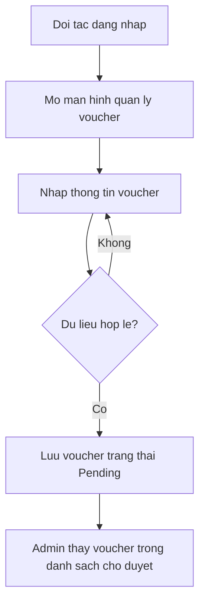
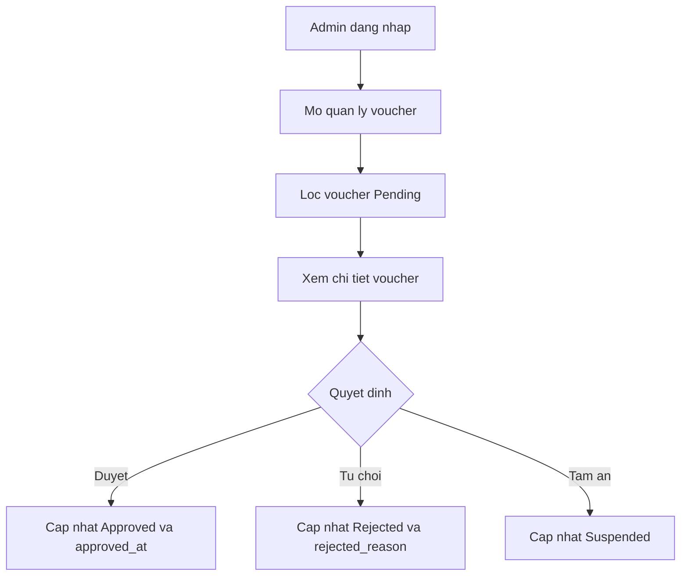
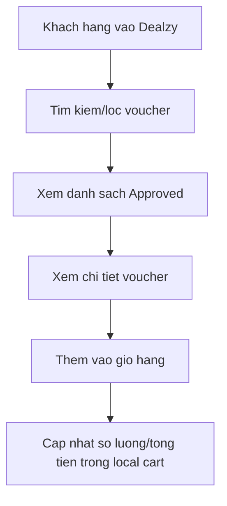
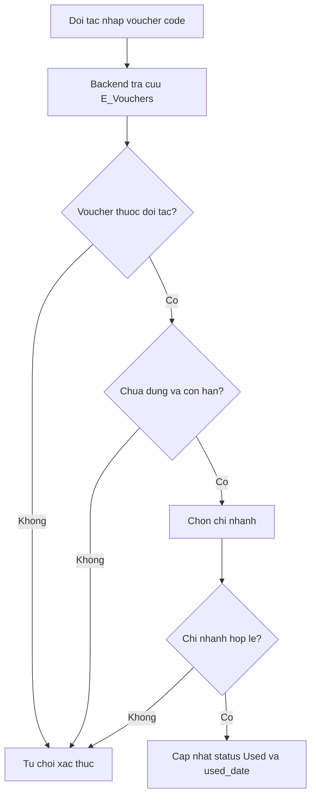

# Bieu do xu ly nghiep vu

Cac bieu do duoi day dung Mermaid, co the dan vao Markdown viewer ho tro Mermaid hoac cong cu draw.io.

## 1. Doi tac tao va gui duyet voucher

## 2. Admin duyet voucher

## 3. Khach hang tim va them voucher vao gio

## 4. Doi tac xac thuc voucher code

